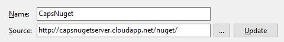
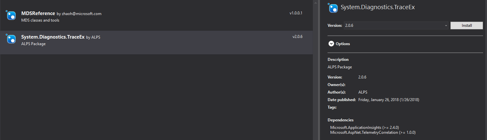
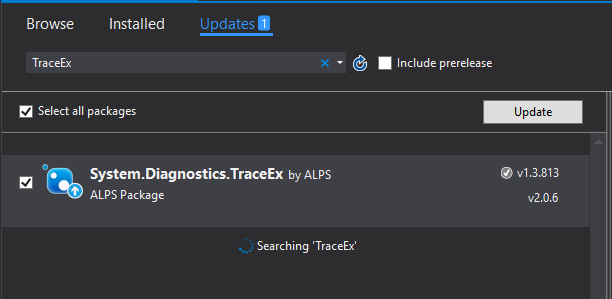
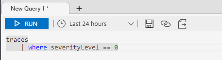
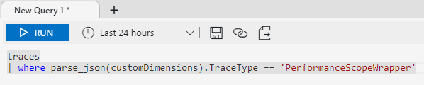
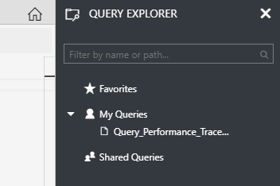

# Unified Trace Solution

This is the spec for unified trace solution for different web system. 

## Overview

Application Insight is introduced to suit our expectation. It can collect Request rates, response times, failure rates, Dependency rates, response times, failure rates, Exceptions, Page views and load performance, it can **diagnostic trace logs** from our app, so that our can correlate trace events with requests. After did some investigation, we suggest trace can go through below ways:

## Code Logic

### Enable Application Insight in Code

#### Add Package

Add package source **Microsoft.ApplicationInsights** to project. It contains the basic Application Insights components used to track trace and send to services.

One alternative is that, if your project is Web App hosted on Azure, you can choose to add package source **Microsoft.ApplicationInsights.Web**, which already contains built-in components that can automatically track the requests, dependency calls, exceptions, etc, without modifying your current application code.

#### Setup InstrumentationKey

Setup correct **InstrumentationKey** before sending any telemetry data to Application Insights service. By default it will be loaded from *ApplicationInsights.config* if exist. Or setup explicitly via code:

    
    TelemetryConfiguration.Active.InstrumentationKey = "abcd1234-abcd-1234-abcd-1234abcd1234";
    

#### Track Telemetry

Create a new TelemetryClient and track telemetry:

    
    TelemetryClient tc = new TelemetryClient();
    tc.TrackTrace("hello");
    

Supported [Data Models](https://docs.microsoft.com/en-us/azure/application-insights/application-insights-data-model): **Request**, **Dependency**, **Exception**, **Trace**, **Event** and **Metric**.

> [!NOTE]
> Telemetries like **Request** and **Dependency** will be automatically tracked after installing package **Microsoft.ApplicationInsights.Web** in Azure Web App.

#### Customize Properties

* [Write your own operation telemetry](https://docs.microsoft.com/en-us/azure/application-insights/application-insights-custom-operations-tracking).

* [Add customized ITelemetryProcessor/ITelemetryInitializer](https://docs.microsoft.com/en-us/azure/application-insights/app-insights-api-filtering-sampling).

### Using TraceEx with Application Insight in Code

#### Enable Application Insight in TraceEx

* Use TrackTrace to record traces

    TrackTrace is used for recording traces in TraceEx. All the ordinary traces will be written into table 'traces' with different severity level and some metadata such as CorrelationId, TraceType and ComponentName.

    Application Insight related methods are in class AppInsights.

* Initialize Application Insight before using

    In order to record traces into Application Insight, InstrumentationKey must be provided before using TraceEx. TraceEx use InstrumentationKey to connect to Application Insight instance.
    Two initialization methods are provided by TraceEx.

    ``` C#

    // Without metadata
    Initialize(string instrumentationKey);

    // With metadata
    Initialize(string instrumentationKey, Dictionary<string, object> globalMetadata);

    ```
    Global metadata will be writen into column customDimensions with other properties such as Category, LogEventTime and CorrelationId.

* Flush traces in memory

    Traces are stored in memory at first, and then, they will be flushed into Application Insight tables. This operation is automatic implemented by Application Insight team. Please refer to [Configuring the Application Insights SDK with ApplicationInsights.config or .xml](https://docs.microsoft.com/en-us/azure/application-insights/app-insights-configuration-with-applicationinsights-config) for more detailed information.

    To ensure all traces in memory have been flushed into Application Insight, method Flush() will be called before an application closed or exit. And Thread.Sleep(int millisecondsTimeout) should be called right after Flush() to ensure the flushing operation done. The current implementation of AppInsights will block the thread for 10s before exiting.

#### How to use TraceEx with Application Insight

Application Insight has been merged into TraceEx from version 2.0.5. It is fully compatible with old versions. So, you do not have to make any changes of your code but upgrade the NuGet package of TraceEx.

##### New user

1. Add package source capsnugetserver to Package Sources

    

2. Install System.Diagnostics.TraceEx (Take version #2.0.6 as an example here)

    

3. Code snippets for using TraceEx

* Initialize TraceEx before using

    * Initialize TraceEx without global metadata

        ``` C#

        TraceEx.Initialize("xxxxxxxx-xxxx-xxxx-xxxx-xxxxxxxxxxxx");

        ```

    * Initialize TraceEx with global metadata

        ``` C#

        TraceEx.Initialize("xxxxxxxx-xxxx-xxxx-xxxx-xxxxxxxxxxxx", new Dictionary<string, object>() { });

        ```

* Use TraceEx to record ordinary traces

    *  Methods provided for recording ordinary traces

        ``` C#

        // Verbose
        Write(string message,
            object data = null,
            string moduleName = null,
            [CallerMemberName] string memberName = null,
            [CallerFilePath] string filePath = null,
            [CallerLineNumber] int lineNumber = 0);
        // Verbose
        WriteLine(string message,
            object data = null,
            string moduleName = null,
            [CallerMemberName] string memberName = null,
            [CallerFilePath] string filePath = null,
            [CallerLineNumber] int lineNumber = 0);
        // Information
        TraceInformation(string message,
            object data = null,
            string moduleName = null,
            [CallerMemberName] string memberName = null,
            [CallerFilePath] string filePath = null,
            [CallerLineNumber] int lineNumber = 0);
        // Information (Force tracing)
        TraceInformationForce(string message,
            object data = null,
            string moduleName = null,
            [CallerMemberName] string memberName = null,
            [CallerFilePath] string filePath = null,
            [CallerLineNumber] int lineNumber = 0);
        // Warning
        TraceWarning(string message,
            object data = null,
            string moduleName = null,
            [CallerMemberName] string memberName = null,
            [CallerFilePath] string filePath = null,
            [CallerLineNumber] int lineNumber = 0);
        // Error
        TraceError(string message,
            object data = null,
            string moduleName = null,
            [CallerMemberName] string memberName = null,
            [CallerFilePath] string filePath = null,
            [CallerLineNumber] int lineNumber = 0);

        ```

    *  Write ordinary traces

        ``` C#

        class Program
        {
            static void Main(string[] args)
            {
                TraceEx.Write("This is ordinary trace of trace type Verbose");
                TraceEx.TraceError("Error detected in ordinary trace");
            }
        }

        ```

* Use TraceEx to record API traces

    ``` C#

    class Program
    {
        static void Main(string[] args)
        {
            using (var apiTraceScope = new APITraceScope("Plus", "TraceExAPIScopeTest"))
            {
                apiTraceScope.SetInputInfo(new Dictionary<string, object> { { "x", 1 }, { "y", 2 } });
                apiTraceScope.AddPair("pair-key", "pair-value");
                int result = Plus(1, 2);
                apiTraceScope.SetComplete(result);
            }
        }

        static int Plus(int x, int y)
        {
            return x + y;
        }
    }

    ```

* Use TraceEx to record performance traces

    ``` C#

    class Program
    {
        static void Main(string[] args)
        {
            using (new PerformanceScope("PlusPerf", "TraceExPerformanceScopeTest"))
            {
                int result = Plus(1, 2);
            }
        }

        static int Plus(int x, int y)
        {
            return x + y;
        }
    }

    ```

##### Upgrade from old version

1. Update System.Diagnostics.TraceEx from the current version to the latest stable version.

    

2. Initialize TraceEx before using

* Initialize TraceEx without global metadata

    ``` C#

    TraceEx.Initialize("xxxxxxxx-xxxx-xxxx-xxxx-xxxxxxxxxxxx");

    ```

* Initialize TraceEx with global metadata

    ``` C#

    TraceEx.Initialize("xxxxxxxx-xxxx-xxxx-xxxx-xxxxxxxxxxxx", new Dictionary<string, object>() { });

    ```

3. No additional operations and code changes should be made.

#### Tips about Application Insight

##### Trace Severity Level

|SeverityLevel|SeverityLevel Value|
|------|------|
|0|Verbose|
|1|Information|
|2|Warning|
|3|Error|
|4|Critical|

##### Limits

|Column Name|Max Length|
|------|------|
|Trace message|32768|
|customDimensions (Max key length)|150|
|customDimensions (Max value length)|8192|
|customDimensions (Total)|64754|
|Exception Problem Id|1024|
|Event Name|512|

> [!NOTE]
> Max Length means the maximum character count. 
> Please find more limits from [Data model](https://docs.microsoft.com/en-us/azure/application-insights/application-insights-data-model)

### Enable Telemetry context
Based on [Monitor multi-compnnent apllications with Application Insights](https://docs.microsoft.com/en-us/azure/application-insights/app-insights-monitor-multi-role-apps) documentation mentioned, we can set customized telemetry context based on Request-Id received from the upstream service. 

## Trace Query and PowerBI Report

### Application Insight Query Analyzer

Application Insight is introduced to suit our expectation. Our system have From the introduction, it can collect Request rates, response times, failure rates, Dependency rates, response times, failure rates, Exceptions, Page views and load performance, it can **diagnostic trace logs** from our app, so that our can correlate trace events with requests. 

#### Query traces from Application Analyzer

Ordinary traces, some API traces and performance traces are stored in table 'traces'. You can query those traces from [Application Analyzer](https://analytics.applicationinsights.io).

Samples:

* Query traces with severityLevel == 0 in last 24 hours.

    ``` Kusto

    traces
    | where severityLevel == 0

    ```

    

* Query performance scope traces in last 24 hours

    ``` Kusto

    traces
    | where parse_json(customDimensions).TraceType == 'PerformanceScopeWrapper'

    ```

    

* Store queries

    Store frequently used queris into 'My Queries' and 'Shared Queries'. You can find them from the QUERY EXPLORER at the top-right corner in Application Analyzer.

    

* Explore exceptions

    If exceptions and errors have been written into table 'exceptions', you can also query them from the Azure portal except quering it from [Application Analyzer](https://analytics.applicationinsights.io).

    For more information about how to query traces, exceptions, custom events and so on, please refer to [Navigation and Dashboards in the Application Insights portal](https://docs.microsoft.com/en-us/azure/application-insights/app-insights-dashboards) and [Analytics in Application Insights](https://docs.microsoft.com/en-us/azure/application-insights/app-insights-analytics).

### Trace History Aggregation

### PowerBI Report for History


